# BastWAN_Minimal_LoRa

A project demonstrating how to do P2P encrypted communication using LoRa on the BastWAN.

It is using the LoRandom library by yours truly and the LoRa library by Sandeep Mistry. You could replace this library with whatever flavor you prefer, just pay attention to which pins are in use, and the functions used to read from and write to SPI. This is important because you need to provide 2 functions:

```c++
void writeRegister(uint8_t reg, uint8_t value) {
  LoRa.writeRegister(reg, value);
  // --> this is the function from LoRa.h
}
uint8_t readRegister(uint8_t reg) {
  return LoRa.readRegister(reg);
  // --> this is the function from LoRa.h
}
```

These 2 functions are used by `LoRandom.h`. Note that technically you shouldn't need `LoRandom.h`, because it has been integrated into LoRa.h – but I have kept working on it and it may have deviated a bit from the original. As it is now, I am including it, to stay on the safe side. Plus, if you want to use another LoRa-related library, YOU WILL NEED IT. Also, see the note below about `LoRa.h`.

This example shows how to deal with random numbers. The code first builds a "stock" of 256 random `uint8_t`. Two functions are provided (although I only use one for now):

```c++
uint8_t getRandomByte() {
  uint8_t r = randomStock[randomIndex++];
  // reset random stock automatically if needed
  if (randomIndex > 252) stockUpRandom();
  return r;
}

void getRandomBytes(uint8_t *buff, uint8_t count) {
  uint8_t r;
  for (uint8_t i = 0; i < count; i++) {
    buff[i] = randomStock[randomIndex++];
    // reset random stock automatically if needed
    if (randomIndex > 252) stockUpRandom();
  }
}
```

The first one gives you one randome byte, as expected. The second stores `count` bytes into a buffer. The "stock" of random bytes is reset if it runs low. Here the threshold is set at 252, but realistically the test should / can be `if (randomIndex == 255) stockUpRandom();`.

The AES encryption / decryption code is the original [Rijndael implementation](http://efgh.com/software/rijndael.htm), and is provided in the sketch. There are better implementations, but it works, and is simple enough to read. Although, with crypto, simple is always debatable!

Transmission has been improved by surround the LoRa send code with:

```c
  digitalWrite(RFM_SWITCH, LOW);
  [...]
  digitalWrite(RFM_SWITCH, HIGH);

```

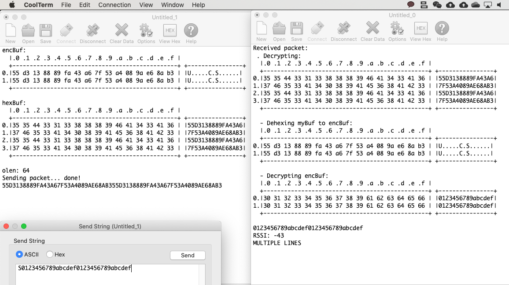

There are a few commands to be used in the Serial Monitor (or another Terminal):

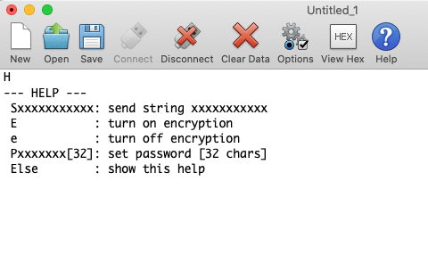

There is an optional PONG back function – which I use to do distance tests. I have a BastWAN on a Keyboard FeatherWing, and I send regularly small messages. If the BastWAN at home receives the message, and the pongback option is on, it will send back a message with its device name and the RSSI. Good enough when you are doing a quick test.

Problems start to crop up when you have several devices listening and ponging back – then some PONGs may be lost, and even if not, only the last one will be shown, as the previous ones will be erased. I plan to remedy to this by creating a message queue, which will store the messages, and in the incoming window, will show a list from which you can choose which message to display. TODO!

The hex-encoded string below the pongback is the original pongback message, displayed for debug purposes. It'll go the way of the dodo soon.

# IMPORTANT

## LoRa library

I am using a customized version of the LoRa library. The change is easy to do but has to be done every time you upgrade it:

```c
  uint8_t readRegister(uint8_t address);
  void writeRegister(uint8_t address, uint8_t value);
```

The declarations of these 2 functions are private, and need to be moved to public. The code needs access to these functions. And honestly there's no good reason for these 2 functions to be private...

*Note:* My code [made it](https://github.com/sandeepmistry/arduino-LoRa/pull/395), and then some, to the LoRa library. I'm still using my own code, but you should be safe using the official version. Anyway, yay to me :-)

## basic_string.h

It is missing some C++ functions, so you need to add the following code to `basic_string.h`, which should be located somewhere like:

    ~/Library/Arduino15/packages/arduino/tools/arm-none-eabi-gcc/<VERSION>/arm-none-eabi/include/c++/<VERSION>/bits/basic_string.h

Version number may vary. There may be several version together... I really wish these frameworks were unified and we didin't need to have identical copies all over the place...

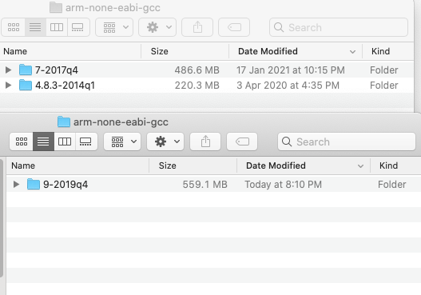

Code:

```c
  namespace std _GLIBCXX_VISIBILITY(default) {
    _GLIBCXX_BEGIN_NAMESPACE_VERSION
    void __throw_length_error(char const*) {}
    void __throw_bad_alloc() {}
    void __throw_out_of_range(char const*) {}
    void __throw_logic_error(char const*) {}
  }
```

*Note:* Putting this in the the .ino file works, but limits the effect to that particular project. Plus/minus. Up to you.

## SparkFun_External_EEPROM.h

You need to define the buffer lengths in `SparkFun_External_EEPROM.h`. BastWAN isn't recognized. Around line 56:

```c
#elif defined(ESP32)
#define I2C_BUFFER_LENGTH_RX I2C_BUFFER_LENGTH
#define I2C_BUFFER_LENGTH_TX I2C_BUFFER_LENGTH

// DEFINITION FOR BASTWAN
#elif defined(_VARIANT_ELECTRONICCATS_BASTWAN_)
#define I2C_BUFFER_LENGTH_RX SERIAL_BUFFER_SIZE
#define I2C_BUFFER_LENGTH_TX SERIAL_BUFFER_SIZE

#else
#pragma GCC error "This platform doesn't have a wire buffer size defined. Please contribute to this library!"

#endif
```

Once this is done, you should be able to compile the code without problems.

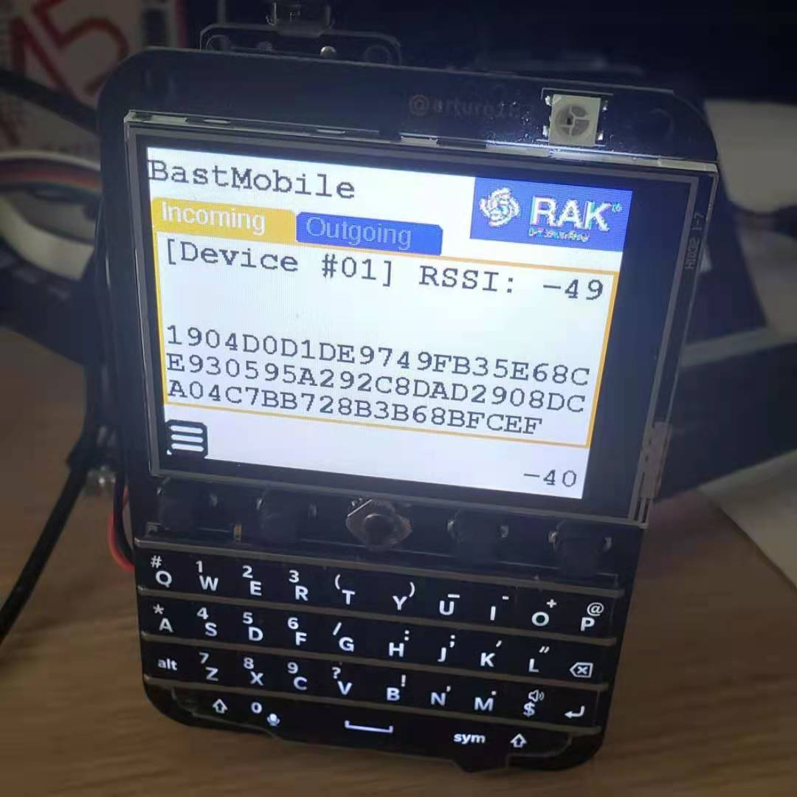

## UPDATE [2021/05/23]

I've played around with settings a bit, adding stuff for Pavel, my outdoors BastWAN. Some features are implemented, others WIP. I've added the possibility to add a BME680 – should you wish to add environment data to your packets. It was originally for the BastMobile, and I retrofitted it in there. Another, separate, environment addition is a DHT22, which I *am* using for the Pavel setup: since it is in a metal enclosure, I want to now how hot it gets in there – it is summer here, and there's lots of sunshine. PONG packets from Pavel contain Temperature & Humidity.

The BastMobile can (and does) save its settings to an SD card. I don;t have this on simpler installs like Pavel, but I do have EEPROMS in a drawer, so I am planning to make use of them and add an I2C EEPROM to save and read settings. WIP.

Again on BastMobile I had a better `showHelp()` menu, so I retrofitted that to this version. It is quite more readable.

There's also an `AutoPing` function – something I have been using on another platform (T-Beam + Android): with a fixed machine pinging on a set schedule, it's easy to detect areas of reception while walking, and log them.


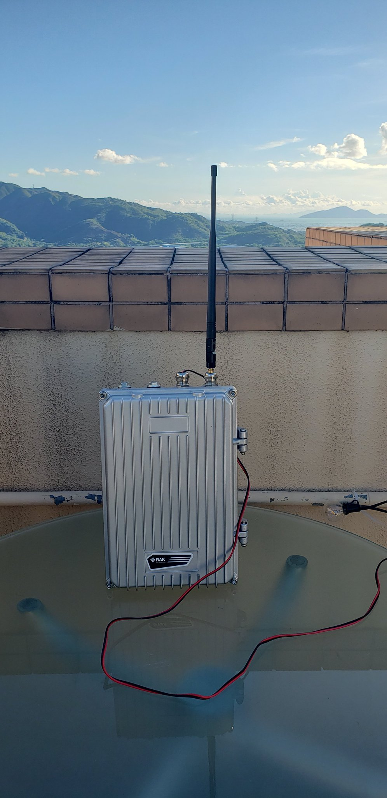

## UPDATE [2021/06/10]

### HMAC

I have added HMAC message authentication. This happens in two parts. Well, 3, really.

1. SHA-2 implementation.

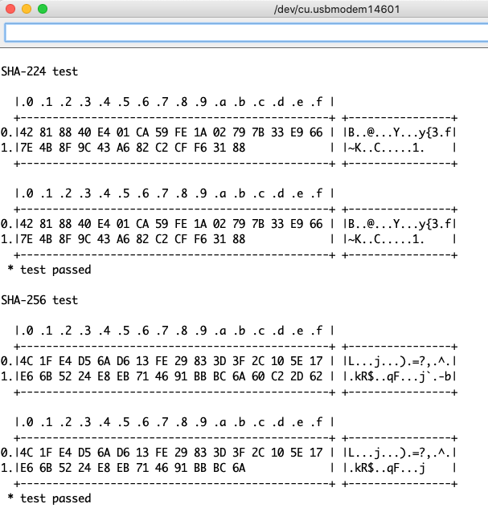

2. HMAC-SHA-2 implementation.

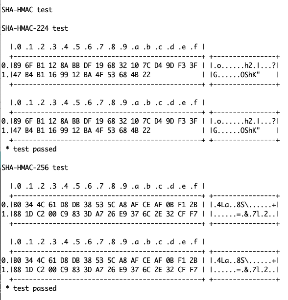

These two by [Olivier Gay](https://github.com/ogay/hmac/). Mucha gracias, collègue.

So once you have this, you need to append HMAC to your encrypted packet. Remember, [Encrypt Then Authenticate](https://moxie.org/2011/12/13/the-cryptographic-doom-principle.html). So I need to take a little detour now. So far, the packets were HEX-encoded: I was using `LoRa.print()`, so a `0x00` in the middle would have ruined my lunch. A bit stupid, but it was a nice exercice in converting efficiently hex values to ASCII and vice-verse. I am now using `LoRa.write(encBuf, olen);`, which cuts the overall size of the buffer in half, and enables me to send more data at once if needed (and I will need it, as I'm writing code to send a low-res image from a camera attached to Pavel on my rooftop, to my BastMobile: the more date in each packet the better).

So I introduced, alongside `needEncryption`, two more options, changeable:

```c
bool needEncryption = true;
bool needHexification = false;
bool needAuthentification = true;
```

`needHexification` allows you to still send hexified packets. It as a Serial command, `HX0~1`. `needAuthentification` is for HMAC. It as a Serial command, `HM0~1`. Here's a test with needHexification on:

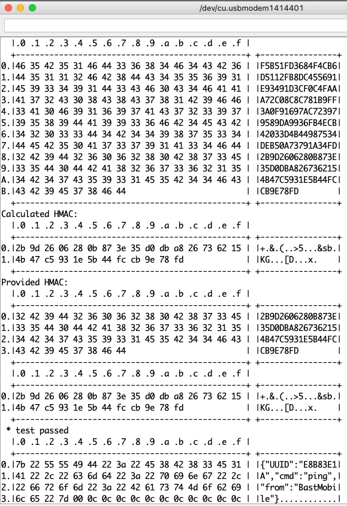

Here is a PING / PONG test, non-hexified, in two parts. Everything works smoothly, even though the output is for not verbose – I needed that to debug...

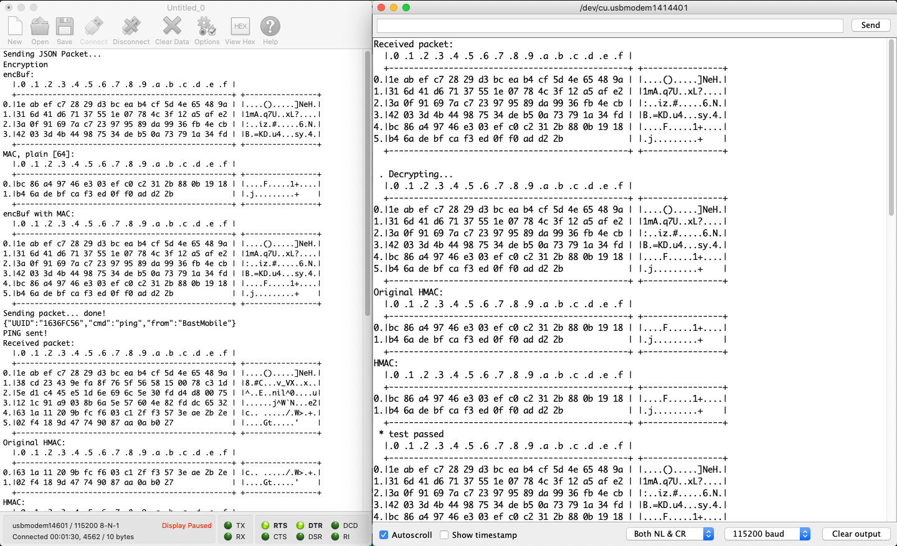

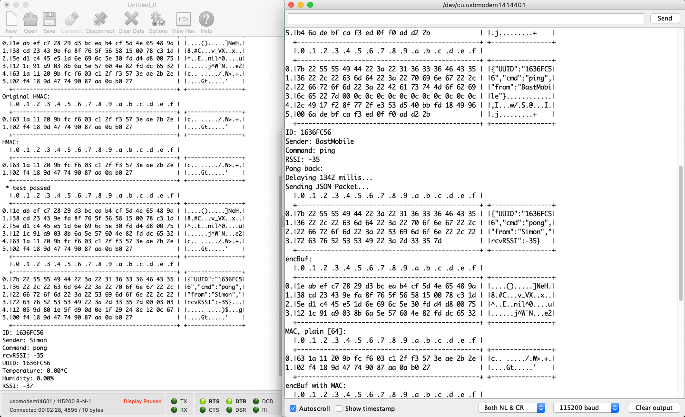

*Ref:* [this Twitter thread](https://twitter.com/Kongduino/status/1402420169826127872).

### Yagi

I bought a Yagi antenna, after a long period of hesitation – not about the Yagi itself, I knew it would be nice, but because I wondered where to put it. Turns out, I have a rooftop, and the parasol is the (almost) perfect stand for the Yagi. Because it's a 433 MHz (which turns out to be an almost perfectly tuned for 468, but AAAANYWAY), I tried it on a TTGO LoRa OLED, sending a PING packet every minute, with a T-beam serving as a receiver, coupled to my Android phone with a custom mapping app.

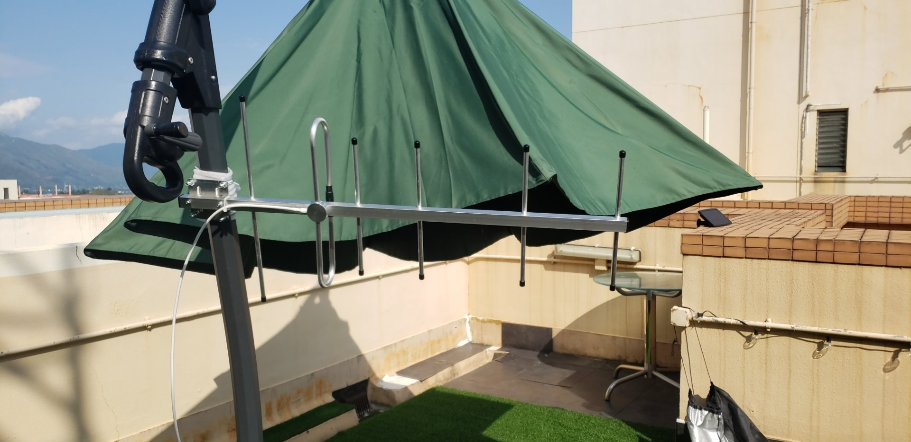
Good enough!

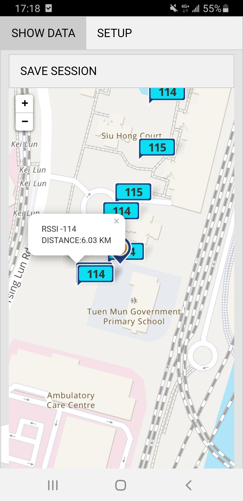
See? 6.06 km. Well it says 6.03 here, but I went a little further out. No Line of Sight. Godzilla buildings everywhere!

So now I need to buy a new Yagi, in 800-924 MHz, so that I can try it with the BastWAN series. Too bad the RAK4260 doesn't exist in 433...

