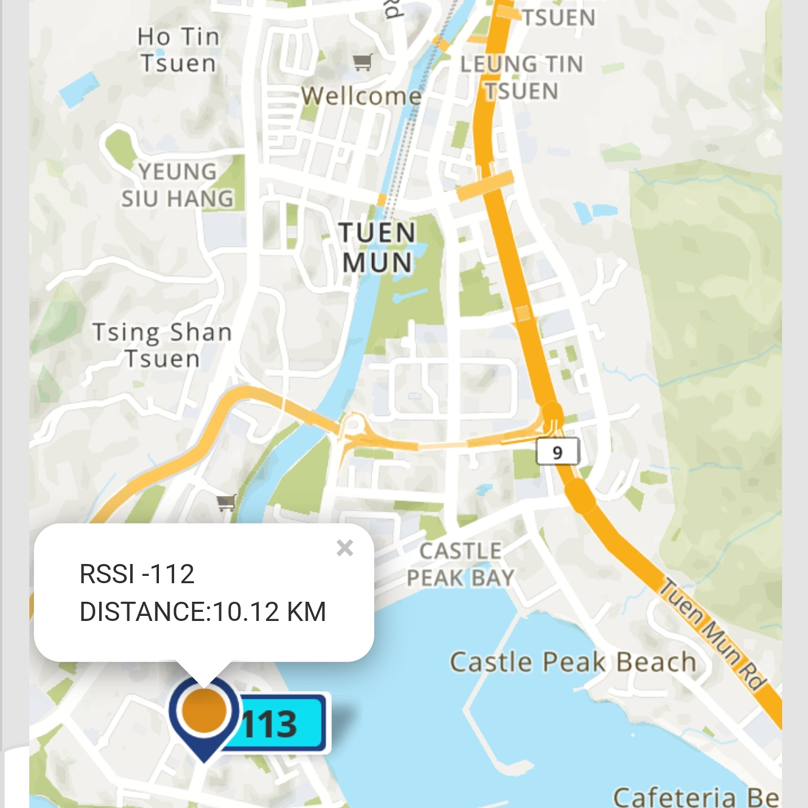

# BastWAN_Minimal_LoRa

A project demonstrating how to do P2P encrypted communication using LoRa on the BastWAN.

It is using the [LoRandom library](https://github.com/Kongduino/LoRandom) by yours truly and the [Arduino LoRa library](https://github.com/sandeepmistry/arduino-LoRa) by Sandeep Mistry. You could replace this library with whatever flavor you prefer, just pay attention to which pins are in use, and the functions used to read from and write to SPI. This is important because you need to provide 2 functions:

```c++
void writeRegister(uint8_t reg, uint8_t value) {
  LoRa.writeRegister(reg, value);
  // --> this is the function from LoRa.h
}
uint8_t readRegister(uint8_t reg) {
  return LoRa.readRegister(reg);
  // --> this is the function from LoRa.h
}
```

These 2 functions are used by `LoRandom.h`. Note that technically you shouldn't need `LoRandom.h`, because it has been integrated into LoRa.h – but I have kept working on it and it may have deviated a bit from the original. As it is now, I am including it, to stay on the safe side. Plus, if you want to use another LoRa-related library, YOU WILL NEED IT. Also, see the note below about `LoRa.h`.

This example shows how to deal with random numbers. The code first builds a "stock" of 256 random `uint8_t`. Two functions are provided (although I only use one for now):

```c++
uint8_t getRandomByte() {
  uint8_t r = randomStock[randomIndex++];
  // reset random stock automatically if needed
  if (randomIndex > 252) stockUpRandom();
  return r;
}

void getRandomBytes(uint8_t *buff, uint8_t count) {
  uint8_t r;
  for (uint8_t i = 0; i < count; i++) {
    buff[i] = randomStock[randomIndex++];
    // reset random stock automatically if needed
    if (randomIndex > 252) stockUpRandom();
  }
}
```

The first one gives you one random byte, as expected. The second stores `count` bytes into a buffer. The "stock" of random bytes is reset if it runs low. Here the threshold is set at 252, but realistically the test should / can be `if (randomIndex == 255) stockUpRandom();`.

The AES encryption / decryption code is the original [Rijndael implementation](http://efgh.com/software/rijndael.htm), and is provided in the sketch. There are better implementations, but it works, and is simple enough to read. Although, with crypto, simple is always debatable!

Transmission has been improved by surrounding the LoRa send code with:

```c
  digitalWrite(RFM_SWITCH, LOW);
  [...]
  digitalWrite(RFM_SWITCH, HIGH);

```


There are a few commands to be used in the Serial Monitor (or another Terminal). Well, it used to be a few. There are now QUITE A FEW:

```
 +==================+================================+
 |     Command      |         Explanation            |
 +==================+================================+
 |/DN<max 32 chars> |                 Set device name|
 | -> right now     |                           Slava|
 +==================+================================+
 |/>xxxxxxxxxxx     |         send string xxxxxxxxxxx|
 +==================+================================+
 |                      OPTIONS                      |
 +==================+================================+
 | /E1 or /e1       |              turn on encryption|
 | /E0 or /e0       |             turn off encryption|
 |  -> right now    |                              on|
 +---------------------------------------------------+
 | /HM1             |          turn on authentication|
 | /HM0             |         turn off authentication|
 |  -> right now    |                              on|
 +---------------------------------------------------+
 | /PW<32 chars>    |         set password [32 chars]|
 | /pw              |      [exactly 32] (Uses AES256)|
 +---------------------------------------------------+
 | /R1 or /r1       |    turn on PONG back [Reply on]|
 | /R0 or /r0       |  turn off PONG back [Reply off]|
 |  -> right now    |                              on|
 +---------------------------------------------------+
 | /FQ<float>       |        Set a new LoRa frequency|
 | Frequency:       |   Between 862 and 1020 MHz (HF)|
 |  -> right now    |                     868.125 MHz|
 +---------------------------------------------------+
 | /SF[7-12]        | Set a new LoRa Spreading Factor|
 |  -> right now    |                              10|
 +---------------------------------------------------+
 | /BW[0-9]         |        Set a new LoRa Bandwidth|
 |                  |   From 0: 7.8 KHz to 9: 500 KHz|
 |  -> right now    |                         125.000|
 +---------------------------------------------------+
 | /CR[5-8]         |           Set a new Coding Rate|
 |  -> right now    |                               5|
 +---------------------------------------------------+
 | /TX[7-17]        |              Set a new Tx Power|
 |  -> right now    |                              20|
 +---------------------------------------------------+
 | /OC1 or /oc1     |                turn on OCP Trim|
 | /OC0 or /oc0     |               turn off OCP Trim|
 |  -> right now    |                             off|
 +---------------------------------------------------+
 | /PB1 or /pb1     |                turn on PA_BOOST|
 | /pb0 or /pb0     |               turn off PA_BOOST|
 |  -> right now    |                              on|
 +---------------------------------------------------+
 | /AP[0-X]         |      Set autoPING OFF (0) or ON|
 |  -> right now    |                             OFF|
 +---------------------------------------------------+
 | /P or /p         |                Send PING packet|
 +==================+================================+
 | Anything else    | show this help message.        |
 +==================+================================+
 | NEED_* OPTIONS   |                                |
 +---------------------------------------------------+
 | NEED_DEBUG       |                             OFF|
 | NEED_EEPROM      |                             OFF|
 | NEED_SIDE_I2C    |                             OFF|
 | NEED_SSD1306     |                              ON|
 | NEED_DHT         |                             OFF|
 | NEED_BME         |                             OFF|
 | NEED_HDC1080     |                              ON|
 | NEED_CCS811      |                              ON|
 +==================+================================+
```

There is an optional PONG back function – which I use to do distance tests. I have a BastWAN on a Keyboard FeatherWing, and I send regularly small messages. If the BastWAN at home receives the message, and the pongback option is on, it will send back a message with its device name and the RSSI. Good enough when you are doing a quick test.

Problems start to crop up when you have several devices listening and ponging back – then some PONGs may be lost, and even if not, only the last one will be shown, as the previous ones will be erased. I plan to remedy to this by creating a message queue, which will store the messages, and in the incoming window, will show a list from which you can choose which message to display. TODO!

In the hex-encoded string below, the pongback is the original pongback message, displayed for debug purposes. It'll go the way of the dodo soon.

On the subject of hex-encoded strings, I have done away with it completely, after making it an option. This was not really a wise choice... I also added HMAC message authentication. See update below, and the `HM` command above.

# IMPORTANT

## Arduino LoRa library

I am using a customized version of this library. The change is easy to do, but has to be done every time you upgrade it:

```c
  uint8_t readRegister(uint8_t address);
  void writeRegister(uint8_t address, uint8_t value);
```

The declarations of these 2 functions are private, and need to be moved to public. My code needs access to these functions. And honestly, there's no good reason for these 2 functions to be private... There was a discussion back when my LoRandom was integrated into Sandeep Mistry's lib, about doing it by default in the lib. Not sure whether it was done.

*Note:* My code [made it](https://github.com/sandeepmistry/arduino-LoRa/pull/395), and then some, to the LoRa library. I'm still using my own code, but you should be safe using the official version. Anyway, yay to me :-)

## basic_string.h

It is missing some C++ functions, so you need to add the following code either to `basic_string.h`, which should be located somewhere like `~/Library/Arduino15/packages/arduino/tools/arm-none-eabi-gcc/<VERSION>/arm-none-eabi/include/c++/<VERSION>/bits/basic_string.h`, or in the .ino file, although that limits the effect to that particular project. Plus/minus. Up to you.

`<VERSION>` may vary. There may be several versions altogether... I really wish these frameworks were unified and we didin't need to have identical copies all over the place...


The code:

```c
  namespace std _GLIBCXX_VISIBILITY(default) {
    _GLIBCXX_BEGIN_NAMESPACE_VERSION
    void __throw_length_error(char const*) {}
    void __throw_bad_alloc() {}
    void __throw_out_of_range(char const*) {}
    void __throw_logic_error(char const*) {}
  }
```

## D_GLIBCXX_USE_C99

You need to add `-D_GLIBCXX_USE_C99` to `compiler.c.flags` & `compiler.cpp.flags` in `/PATH/TO/Arduino15/packages/electroniccats/hardware/samd/<VERSION>/platform.txt`, or the code won't compile.


## SparkFun_External_EEPROM.h

If you're planning to use an EEPROM to save prefs, you need to define the buffer lengths in `SparkFun_External_EEPROM.h`, as BastWAN isn't recognized. Around line 56:

```c
#elif defined(ESP32)
#define I2C_BUFFER_LENGTH_RX I2C_BUFFER_LENGTH
#define I2C_BUFFER_LENGTH_TX I2C_BUFFER_LENGTH

// DEFINITION FOR BASTWAN
#elif defined(_VARIANT_ELECTRONICCATS_BASTWAN_)
#define I2C_BUFFER_LENGTH_RX SERIAL_BUFFER_SIZE
#define I2C_BUFFER_LENGTH_TX SERIAL_BUFFER_SIZE

#else
#pragma GCC error "This platform doesn't have a wire buffer size defined. Please contribute to this library!"

#endif
```

Once this is done, you should be able to compile the code without problems.


## UPDATE [2021/05/23]

I've played around with settings a bit, adding stuff for Pavel, my outdoors BastWAN. Some features are implemented, others WIP. I've added the possibility to add a "HT" sensor: DHT, BME680, HDC1080, should you wish to add environment data to your packets. It was originally for the BastMobile, and I retrofitted it in there.  I am using a DHT22 for the Pavel setup: since it is in a metal enclosure, I want to know how hot it gets in there – it is summer here, and there's lots of sunshine. PONG packets include Temperature & Humidity if a sensor is available. The 3 sensors use the same set of global variables.

The BastMobile can (and does) save its settings to an SD card. I don't have this on simpler installs like Pavel, but I do have EEPROMs in a drawer, so I am planning to make use of them and add an I2C EEPROM to save and read settings. WIP. See above the `SparkFun_External_EEPROM` note.

Again on BastMobile I had a better `showHelp()` menu, so I retrofitted that to this version. It is quite more readable.

There's also an `AutoPing` function – something I have been using on another platform (T-Beam + Android): with a fixed machine pinging on a set schedule, it's easy to detect areas of reception while walking, and log them. There isn't an option (yet) to set it up in the Serial monitor, WIP.


## UPDATE [2021/06/10]

### HMAC

I have added HMAC message authentication. This happens in two parts. Well, three, really.

1. SHA-2 implementation.


2. HMAC-SHA-2 implementation.


These two by [Olivier Gay](https://github.com/ogay/hmac/). Muchas gracias, collègue.

So once you have this, you need to append HMAC to your encrypted packet. Remember, [Encrypt Then Authenticate](https://moxie.org/2011/12/13/the-cryptographic-doom-principle.html). So I need to take a little detour now. So far, the packets were HEX-encoded: I was using `LoRa.print()`, so a `0x00` in the middle would have ruined my lunch. A bit stupid, but it was a nice exercice in converting efficiently hex values to ASCII and vice-verse. I am now using `LoRa.write(encBuf, olen);`, which cuts the overall size of the buffer in half, and enables me to send more data at once if needed (and I will need it, as I'm writing code to send a low-res image from a camera attached to Pavel on my rooftop, to my BastMobile: the more data in each packet the better).

So I introduced two options, changeable:

```c
bool needEncryption = true;
bool needAuthentification = true;
```

`needAuthentification` is for HMAC. It as a Serial command, `HM0~1`. Here's a test with needHexification on:


Here is a PING / PONG test, non-hexified, in two parts. Everything works smoothly, even though the output is for not verbose – I needed that to debug...


*Ref:* [this Twitter thread](https://twitter.com/Kongduino/status/1402420169826127872).

### Yagi (Warning! not BastWAN related! _YET!_)

I bought a 433 MHz Yagi antenna, after a long period of hesitation – not about the Yagi itself, I knew it would be nice, but because I wondered where to put it. It turns out, I now have a rooftop, and the parasol is the (almost) perfect stand for the Yagi. Because it's a 433 MHz (although it turns out to be almost perfectly tuned for 468 MHz, but AAAANYWAY), I tried it on a TTGO LoRa OLED, sending a PING packet every minute, with a T-beam serving as a receiver, coupled to my Android phone with a custom mapping app.


Good enough!


See? 6.06 km. Well it says 6.03 here, but I went a little further out. No Line of Sight. Godzilla buildings everywhere!


And of course I had to go and beat that by a wide margin 2 days later... It's a little less conclusive, in the sense that I had to hunt (under a harsh sun and debilitating heat, someone should pay me to do this, oh wait... They are!) for a good location to receive the PING from home. Whereas above in the 6-km test, I had constant reception, with barely a missed packet. This is probably because the hood I went down to, TM, is nested in a narrow corridor between mountains, and the buildings density is to great to allow good reception. TM is much more densely populated than my hood, and while both consist of Godzilla buildings, mine is quite airy, with wide open space between buildings. In TM, everything is packed together, with absolutely no empty spaces, save for the big roads. So I found an overpass, over a wide road, pointing towards my home, and lo and behold, I received pings constantly.


So now I need to buy a new Yagi, in 800-924 MHz, so that I can try it with the BastWAN series. Too bad the RAK4260 doesn't exist in 433... I could have played with just the one antenna (and performance is better in that range anyway...) I might also get other antennas to test, but my bet is on a good Yagi.


## UPDATE [2021/07/04]

### SSD1306 OLED

I added code for an SSD1306 OLED. Current code is for a 128x32, but a line can be changed for other formats.

`#define OLED_FORMAT &Adafruit128x32`

Change that to something else if need be.

A lot of stuff is logged to the screen (probably too much) at startup, but after that only the most important events are logged: send ping, received packet, Temperature & Humidity, etc. The define is `NEED_SSD1306`.

### HDC1080

I added a third environment sensor to the choices, an HDC1080. I have a dual HDC1080/CCS811 sensor, but for the moment HDC1080 is enough. So there are 3 defines available: `NEED_BME`, `NEED_DHT`, `NEED_HDC1080`. Note that these are not mutually exclusive – if you want to have all 3, have at it.

### PING_DELAY

The first 2 sensors had each their own define for the delay, now all 3 have the same, `PING_DELAY`. Not a good name, will change later.

### Sets

Most of the framework for Sets is in place, need testing now. Sets is basically an array of Freq, SF, BW sets, which can be sent over the air, and one machine (normally a BastMobile) can request a change with just one command. WIP.

### 868 Yagi

As described in [this blog post](https://kongduino.wordpress.com/2021/06/30/and-of-course-i-bought-another-yagi/), I have bought a Yagi for my 868 devices, and it seems to be working quite well: 7.5 km so far, with the yagi (awkwardly) installed indoors.


## UPDATE [2021/07/11]

This update adds a command to a feature that was already available in code, but not to the serial commands suite. Deep down in the code there is a `needPing` boolean. If it's `true`, a ping will be sent every `pingFrequency` milliseconds. Pavel gets an automatic setup to 2 minutes in this iteration:

```c
#ifdef Pavel
// enable autoPing for Pavel
double pingFrequency = 120000;
// 120,000 ms = 2 mn
bool needPing = true;
#else
double pingFrequency = 0;
bool needPing = false;
#endif
```

This is changeable with the `/AP` command:

`| /AP[0-X]         |      Set autoPING OFF (0) or ON|` <-- See the help menu above.

Whereby `0` means turning it off, and any other number will be in minutes. I have set two slightly artificial limits: minimum 1 minute, maximum 10 minutes.

```c
  if (fq < 60000) fq = 60000;
  if (fq > 600000) fq = 600000;
```

You can change this to match your needs.

As mentioned in the HDC1080 update, the CCS811 had been left alone. This is been updated: a `NEED_CCS811` define has been added, dependent on the `NEED_HDC1080` define. So you can now add tBOC and CO2 data to your output. If `NEED_CCS811` is defined, `sendPing` and `sendPong` will add tVOC and CO2 data to the packet. Likewise, when a packet is received, environment data present in the packet will be displayed (either in the Serial terminal and/or on the OLED, depending on your `NEED_*` options).

Speaking of `NEED_*` options, they're now displayed in the help menu, see above.

`NEED_DEBUG`, which was an `int`, is now a define too.